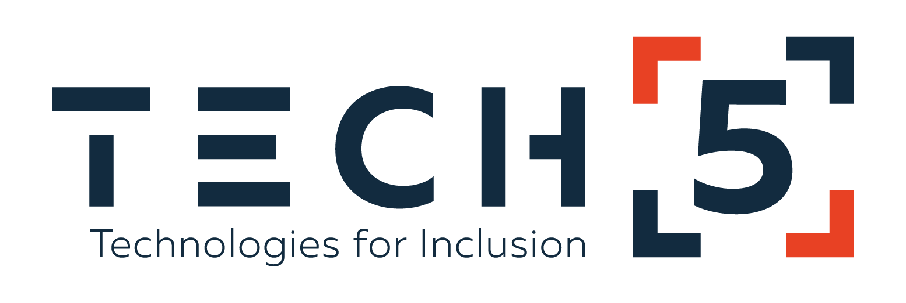

# Mauritania eID for Android Release Notes

Product version: **1.0.3**. Release date: **2023-02-25**. Document version: **1.5**. Document date: **2023-02-25**

---

## Overview

The goal for this application is to enable a password-less authentication to Mautinania's e-Government portals, based on a biometric identity verification.

A secure, user-friendly, and privacy-preserving digital identity is a necessary precondition for Mauritania's e-Government services, as it enables trusted interactions between citizens, government authorities and the private sector. This need is recognised in the Digital Agenda 2022-2025, containing 10 Quick Wins as identified by Ministry of Digital Transition, Innovation and Public Sector Modernisation (MTNIMA) and the results of the joint United Nations Development Programme (UNDP) and MTNIMA for Digital Readiness Assessment 2021.

To fulfil this, an RFP was published by UNDP for a Digital ID mobile application and a corresponding backend which was won by SmartMS, with TECH5 as the mobile application provider.

## New Features

- 

## Improvements

-Embedded regula database removed from app to reduce the apk size. Database will be downloaded when the app starts for the first time.

## Fixes

- 

## Expected Impact

None.

## Dependencies

- Android OS version 6.0 or above.
- The phone needs to have NFC capability to read Mauritania ID card.

## References

- UNDP RFP (https://procurement-notices.undp.org/view_file.cfm?doc_id=301323)

---

# Legal Disclaimer

The information contained in this document is the proprietary and exclusive property of TECH5, except as otherwise indicated. No part of this document, in whole or in part, maybe reproduced, stored, transmitted, or used for design purposes without the prior written permission of TECH5.

The information contained in this document is subject to change without notice. The information in this document is provided for informational purposes only. TECH5 specifically disclaims all warranties, express, or limited, including, but not limited, to the implied warranties of merchantability and fitness for a particular purpose, except as provided for in a separate software license agreement.