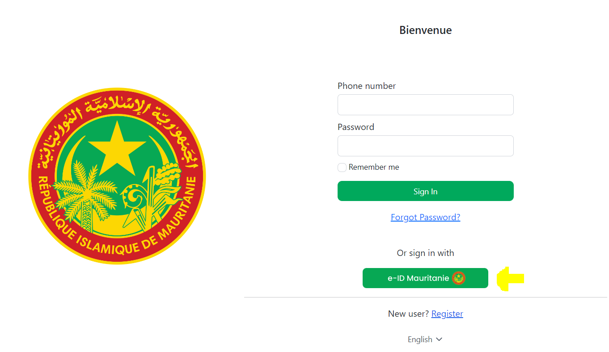

# Digital ID Middleware Readme

The middleware is the interface for Digital ID mobile app to perform the core functionnalities of the system.

The middleware is based on Spring boot backend, exposing RESTFUL APIs to ensure the interaction between the DI mobile app and the rest of the system components.

`Java version V 11`

## Project structure

The project is Spring boot microservices backend, for the clarity and an easy access to the code, we have created these packages or directories to guide the developper easily, the pakages are:

- **com.smartmssa.digitalIDmiddleware**: which  is the main package which contain the all other packages and the main class of the project.

- **client**: this package is used to call external APIs

- **config** : contains all configuration classes

- **controller** : contains the exposed APIs

- **dto** : contains all the DTO classes to be used in APIs call

- **exception**: to manage the possible exception

- **model**: contains all the database entities classes

- **repository**: contains all the interfaces to interact with databases 

- **service**: contains the business logic and functionnalities of the project

- **utils** : contains all the common used classes

## Project dependencies

The middleware has some dependencies to ensure his core functionnalities, among the main dependencies the following:

**Spring Web** : for exposing the RESTFUL APIs

**Spring Jpa**: for database integration

**Spring  Security**: to secure the access to the APIs

**Spring Testing**: to test the functionalities

**feign client**: to call external APIs

**Keycloak** : to interact with Keycloak IDP

## **Project interfaces**

The middleware has some interface to performe his core functionalities which are:

- **Idencode server** to generate the cryptograph 

- **Keycloak IDP** to authenticate users

## **Middleware APIs:**

APIs are secured using basic authentication 

**Idencode Server to get the cryptograph**

-    POST /api/getCryptography

- 

- User attributes are sent to the Idencode Server API to get the cryptograph as image like the above response

**Public key API**

- GET /api/getPublicKey

- 

- This API returns RSA public key as base64 string, used for cryptograph digital signature 

**Add user to the Keycloak IDP**

- POST /api/addUser

- 

- This API is called by the DI mobile app after a successful face recognition, it registers the user inside the keycloak IDP and returns the user password

**Connection to IDP**

- POST /api/establishConnection

- 

- This API is used to connect the user to the IDP, the **qrAuth** is the Qr code retrieved string sent along with the current scanning user's username (NNI)

- The Qr code page for authentication:
  
  - 

**Establish session**

- POST /api/getValues

- 

- This API is public and it is called periodically by the qrcode page and the passed **value** is the Qr code string value, and then the API returns as response the user credentials to the Qr code page in order to log in. The Qr code string is used only once to get response from this API.

# Keycloak IDP configuration

`keycloak version 19.0.3`

Firstly we change the keycloak admin console theme to <mark>keycloak</mark>

- Create Realm named **Digital-id**

- Create client named **Admin-api-config-client**

 With Access Type **confidential** and **Service Accounts Enabled** is **on**

Go to **Service Account Roles** tab :

Add those roles from realm-management client to the Services Account Roles in order to be able to manages users through the client **Admin-api-config-client**.

- Create **Keycloak user groups** :
  
  - citizens
  
  - default

    Then we add the default group to keycloak user default groups:

- The we create an privileged user called **admin-api-user**
  
  
  
  - with specified passowrd in application.properties file
    
    - Add roles to this user :
      
      
  
  - Through this user we'll be able to use Keycloak Admin REST API  to create account for the Digital ID users in Keycloak IDP as authenticated citizens' group users

Let's now set the Qrcode theme for the login page of Digital-id realm, we click on Realm Settings then we select qrcode theme:

## Integration of the Keycloak IDP in Egov portal

#### Keycloak IDP side :

- Let's configure keycloak IDP **broker client**  to be accessible for the Egov portal IAM:
  
  -  Change the Access Type to **confidential**

We need to set  **Valid Redirect URIs** to the entry endpoint of the keycloak IDP in Egov IAM :

- Also we need to send user extra attributes to Egov IAM to be mapped:
  
  
  
  

### Egov IAM side

- Let's add Keycloak IDP as an identity provider in Egov keycloak IAM:
  
  Identity Providers -> Keycloak OpenID connect
  
  

- Identity Provider configuration :
  
  
  
  **Redirect URI** is the one that we have passed to the keycloak IDP **broker** client **valid rediredct uri** field

        **Alias** should be **di** so that the Digital ID button appears on Egov login otherwise            the **Display Name** field value is shown 

- Let's scroll down 

All those endpoints should be provided, they are accessible from Realm setting of the keycloak IDP:

Then we specify the **client ID** to the keycloak IDP **broker** client and its secret key:

- Bottom of Identity provider configuration

- Identity Provider mappers 
  
  

That's all for the integration between the EGOV IAM and Digital ID IDP

Egov portal login with Digital ID IDP button:

When user click on e-ID Mauritanie button he will be redirected to the Digital ID QR code page.

---

**SMARTMSSA** ALL RIGHTS RESERVERD
